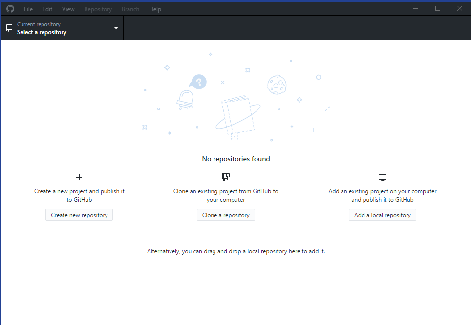
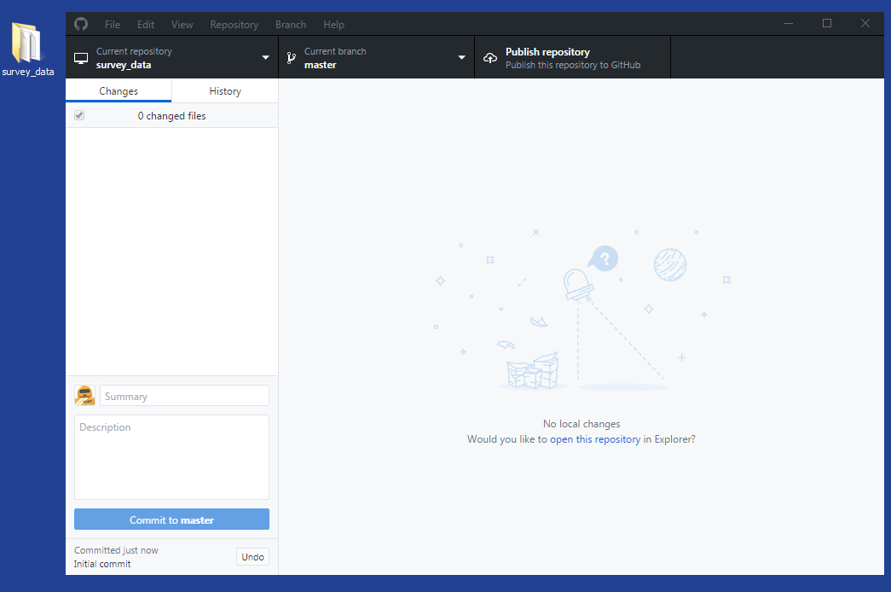

Once Git is configured,
we can start using it.

Let's create a new repository for our work.  In this lesson we're going to be adding additional information
to the survey_data_clean.csv file we worked on in the "Data Organization" part of the workshop. Click 
"Create new repository".  

Then we give our repository a name - in this case `survey_data`.  
We also choose the location to put the repository on our local computer.  For this workshop it's easier to
put the repository on your desktop.  It's also good practice to check the README box, which will create a blank
file where we can put information about our content.  There are also options for Git ignore (which handles files
you don't want tracked) and a License, both of which are outside the scope of this workshop.  

If you look on your desktop you'll see a new folder.  This is your new repository, which is just like any other
folder on your computer.  However, it is also special because Git can now track versions of your files.

You'll now see that GitHub desctop shows the status of your repository.  You haven't added anything yet,
so no changes show up.

> ## Advanced tip
> If you navigate to the `survy_data` directory on the command line
> and use `ls -a` flag to show everything,
> we can see that Git has created a hidden directory within `survey_data` called `.git`:
> 
> ~~~
> $ ls -a
> ~~~
> {: .bash}
> 
> ~~~
> .	..	.git
> ~~~
> {: .output}
>
> Git stores information about the project in this special sub-directory.
> If we ever delete it,
> we will lose the project's history.
>
{: .callout}

> ## Places to Create Git Repositories
>
> Try to create a new git repository inside of the `survey_data` repository you just created.
> Since you don't have the welcome screen anymore, you'll need to go to File/New Repository.
>
> What happens?  Can you create the sub-repository? Why is it a bad idea to do this? 
>
> > ## Solution
> >
> > Git repositories can interfere with each other if they are "nested" in the
> > directory of another: the outer repository will try to version-control 
> > the inner repository. Therefore, it's best to create each new Git
> > repository in a separate directory. Git Desktop is smart enough to block this operation, 
> > even if the repository wasn't created in GitHub Desktop (that's the suggestion in the yellow triangle-
> > we've already added the repo so it doesn't do anything).
> {: .solution}
{: .challenge}
