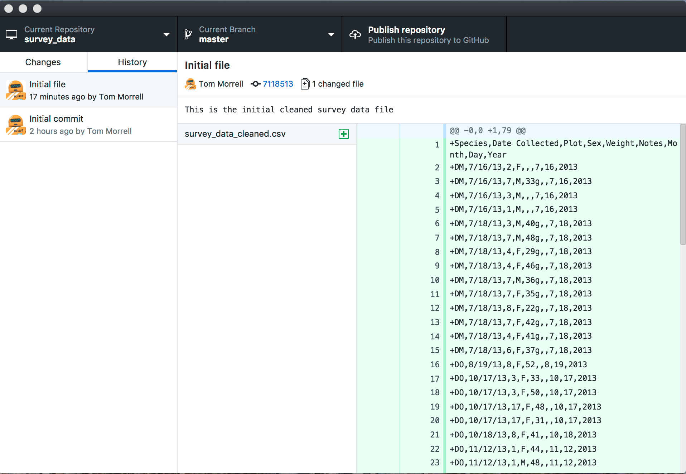
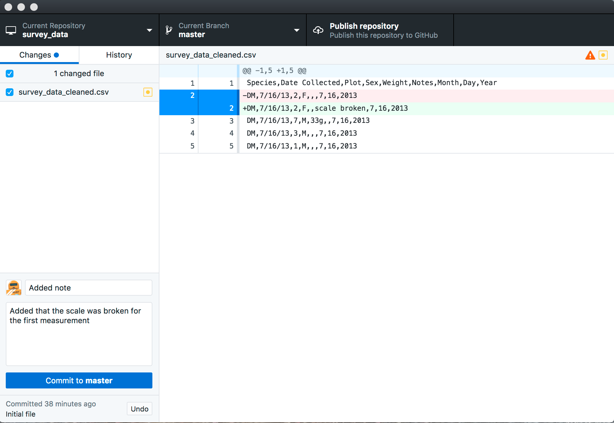

You should now have a `survey_data` repository on your desktop.

Drag `survey_data_cleaned.csv`, which was the end result of the Data Organization lesson.

You can also download this file [here](https://raw.githubusercontent.com/caltechlibrary/git-desktop/gh-pages/data/survey_data_cleaned.csv)

You'll see that GitHub Desktop has changed to signify that a new file has been added. The left hand panel, which shows changes that have occurred in the repository, lists the new file.  It knows this is a new file that it will have to add to the repository, as indicated by the green plus sign.  In addition, contents of the file applear in green in the right hand panel, which provides details about the changes.  

In order to save this version of the file, we need to commit our changes. To do this we need to write a commit meddage that describes our changes.  You can provide both a short summary of the changes and a longer description by typing in the lower left hand corner of Git Desktop. Then click Commit to master.   

When we commit our changes,
Git takes everything we have told it to save 
and stores a copy permanently inside the special `.git` directory.
This permanent copy is called a [commit]({{ page.root }}/reference/#commit)
(or [revision]({{ page.root }}/reference/#revision)) and is assigned a identifier.  

If you click the History tab you'll see a record of the changes you have made.  The "Initial commit' was generated automatically when you requested a Readme file to be added to the repository, and at the top you'll see the commit we made with the summary "Initial file".  More details are listed on the right hand side, including the description and a short version identifier for the commit (7118513 in the example - yours will be different). 

> ## Where Are My Changes?
> If we look in our directory at this point, we will still see just one file called `survey_data_cleaned.csv`.
> That's because Git saves information about files' history
> in the special `.git` directory mentioned earlier
> so that our filesystem doesn't become cluttered
> (and so that we can't accidentally edit or delete an old version).
{: .callout}

Now let's open up our data file in a spreadsheet program.  In reality you'll want to make most changes to data files using code (we'll talk about this tomorrow), but for now we're going to manually make changes to see how things work.  Some of the fields in the data file don't have weights.  Let's add a some text in the first note field that the scale was broken.  Save the file (Because you're working with a csv file Excel may complain.  Make sure that your data file is still saved as a csv).

When we switch back to Git Desktop, we see that something has happened in Changes tab.  Our data file appears in the left hand panel with a yellow star, which signifies that this file has been changed.  In the right hand panel we can see that one line in our .csv file, shown in green, has been added (it includes the "scale broken" note).  It also shows that the line without the note has been removed, shown in red.  If we write a commit message these changes will be saved in our history.

When we look at the history tab, we can see our new commit in the list.  It's got a completly different identifier.  Note that git only saves the history of changes, as opposed to multiple copies of files.  This is why git works well for text files and code, but not so well for images and binary files.

> ## Directories
>
> Two important facts you should know about directories in Git.
>
> 1. Git does not track directories on their own, only files within them.
> Try adding a folder to surveys_daya
> 
> Note, our newly created empty directory `directory` does not appear in
> the chnges tab of Git Desktop. This is the reason why you will sometimes see `.gitkeep` files
> in otherwise empty directories. Unlike `.gitignore`, these files are not special
> and their sole purpose is to populate a directory so that Git adds it to
> the repository. In fact, you can name such files anything you like.
>
>
{: .callout}

> ## Choosing a Commit Message
>
> Which of the following commit messages would be most appropriate for the
> last commit made to `mars.txt`?
>
> 1. "Changes"
> 2. "Added line 'But the Mummy will appreciate the lack of humidity' to mars.txt"
> 3. "Discuss effects of Mars' climate on the Mummy"
>
> > ## Solution
> > Answer 1 is not descriptive enough,
> > and answer 2 is too descriptive and redundant,
> > but answer 3 is good: short but descriptive.
> {: .solution}
{: .challenge}

[commit-messages]: http://chris.beams.io/posts/git-commit/
